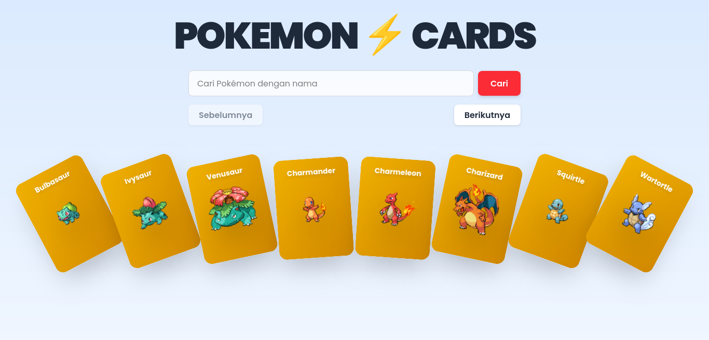
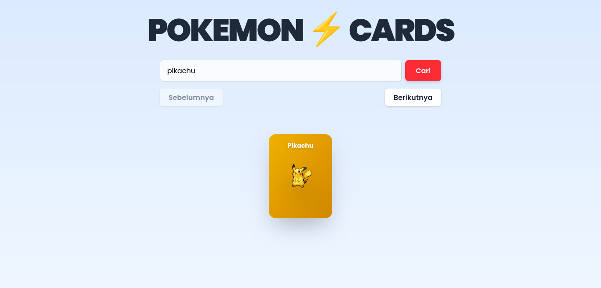
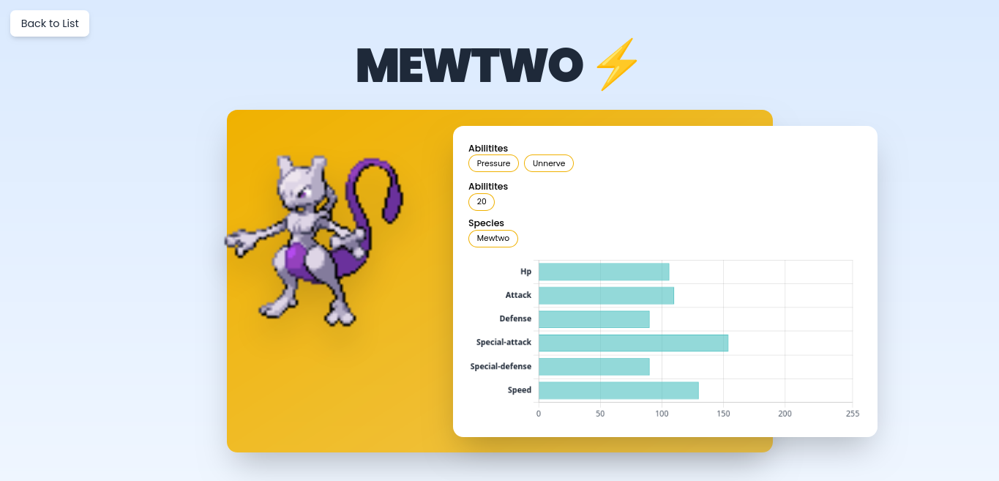

# Simple Pokemon App

## Tech Stack

- **React** - Library JavaScript untuk membangun user interface
- **TypeScript** - Superset JavaScript dengan tipe statis
- **TanStack Query** - Library untuk data fetching dan state management
- **Axios** - HTTP client untuk melakukan request API
- **PokeAPI** - RESTful API untuk data Pokemon
- **Framer Motion** - Animation library

## Screenshots







## Prerequisites

- Node.js
- Git

## Installation

### 1. Clone Repository

```bash
git clone https://github.com/maybeenang/test-fe-fanintek
cd test-fe-fanintek
```

### 2. Install Dependencies

```bash
npm install
```

### 3. Menjalankan Development Server

```bash
npm run dev
```

### 4. Membuka Aplikasi

Setelah development server berjalan, buka browser dan akses:

```
http://localhost:5173
```

